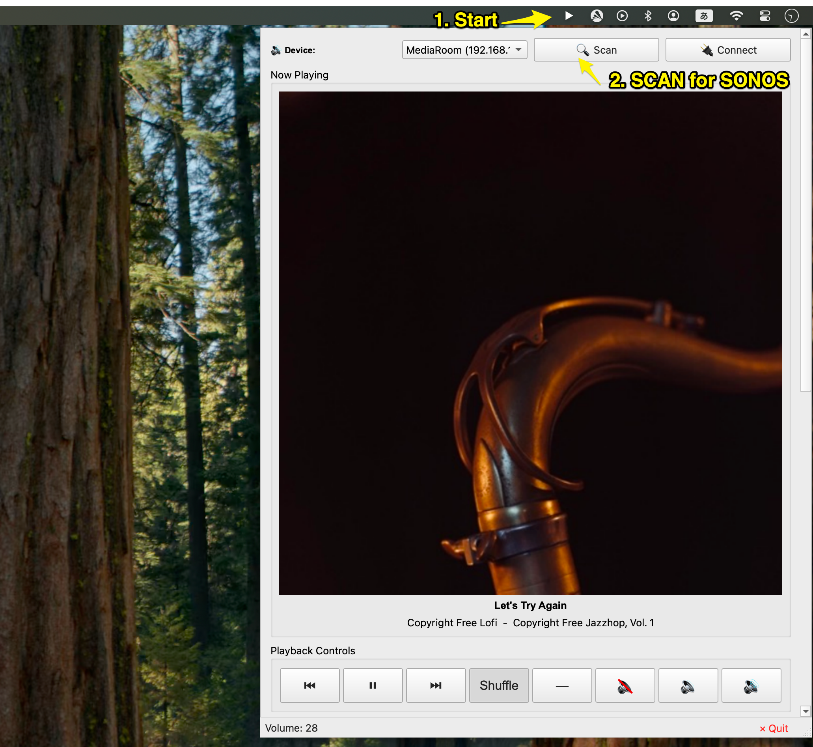
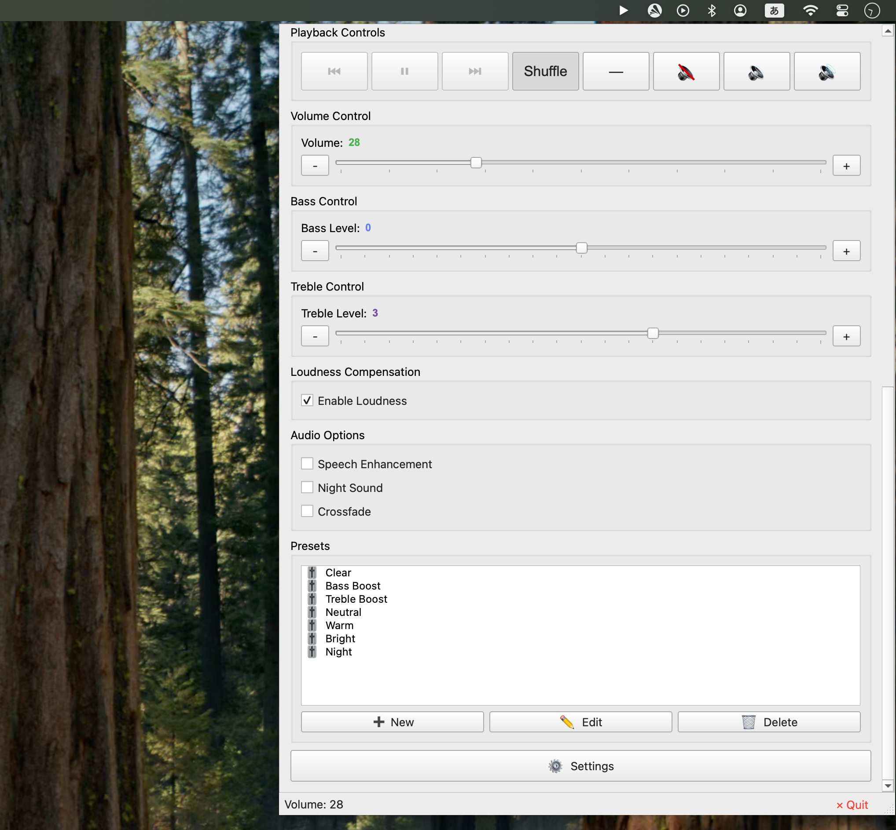

# TuneRay — SONOS EQ Controller

A Python GUI application for intuitive control of SONOS RAY speaker equalizer settings via the macOS menu bar.





---

## Highlight Feature

### Control SONOS RAY over Optical Audio Input

With **SONOS RAY**, volume and EQ are normally inaccessible from any app when audio is fed via **optical digital (Toslink) input** rather than AirPlay or Spotify Connect.

TuneRay works around this limitation. By routing audio through the adapter below, you can **adjust volume, Bass, Treble, and Loudness in real time — even during optical input**.

> **Recommended Adapter**
>
> [Bluetooth Transmitter / Optical Digital Adapter (Amazon)](https://amzn.to/4adcL4p)

**Connection diagram:**

```
TV
  └─[Optical Toslink]─▶ Adapter ─▶ SONOS RAY (AUX input)
                                        ↑
                              TuneRay controls volume
                              & EQ over Wi-Fi
```

> **Note:** Album art and track info require the SONOS device to be connected via Wi-Fi.

---

## Features

- **Equalizer** — Bass & Treble ±10 adjustment
- **Audio options** — Loudness, Speech Enhancement, Night Mode, Crossfade
- **Playback control** — Play/Pause, Previous/Next, Shuffle, Repeat, Mute
- **Volume HUD** — macOS-style overlay on volume change
- **Presets** — Built-in and custom EQ presets
- **Auto-discovery** — Finds SONOS devices on the network (multicast + ARP fallback)
- **Device cache** — Remembers the last-used device
- **Multilingual** — Japanese / English (switchable in settings)

---

## Requirements

| Item     | Detail                                    |
| -------- | ----------------------------------------- |
| OS       | macOS                                     |
| Python   | 3.8+                                      |
| Hardware | SONOS RAY (or any SoCo-compatible device) |

---

## Installation

```bash
pip install PyQt6 soco pynput
```

> **macOS note:** The app requests Accessibility permission on first launch (required for media key support).

---

## Usage

```bash
python sonos_eq_gui_advanced.py
```

1. The app appears as a **menu bar icon** (▶). Click it to open/close the panel.
2. On first run, SONOS devices are discovered automatically. Results are cached for subsequent launches.
3. Adjust sliders, toggle checkboxes, apply presets, or use media keys.

---

## File Structure

```
TuneRay/
├── sonos_eq_gui_advanced.py   # Entry point — Qt GUI main window
├── src/
│   ├── controller.py          # SonosEQController (framework-agnostic)
│   ├── models.py              # Data models & preset persistence
│   ├── strings.py             # Multilingual UI strings
│   └── TuneRay.icns           # App icon
├── assets/
│   └── icon/                  # Source icon assets
├── TuneRay.spec               # PyInstaller build spec
└── README.md
```

---

## Design Principles

### No external app control

The app only controls the SONOS device itself. It never launches or controls Apple Music, Spotify, or other players (no AppleScript).
Pressing media keys while an AirPlay or optical-input stream is active only shows a status message.

### Keyboard listener safety

`pynput` is always started with `suppress=False` to avoid blocking keyboard input in other apps.

### Framework-agnostic core

`src/controller.py` and `src/models.py` have no dependency on PyQt6, making it straightforward to swap the GUI layer.

---

## Troubleshooting

### Device not found

- Ensure the device and Mac are on the same Wi-Fi network.
- Confirm the device is visible in the official SONOS app.
- Check firewall settings (UDP 1900 for SSDP).

### Settings not applied

- Check the SONOS RAY power status.
- Re-select the device or press **Refresh** in Settings.

### Accessibility permission

- Go to **System Settings → Privacy & Security → Accessibility** and enable TuneRay.

### "Apple cannot verify..." warning

TuneRay is not notarized with Apple, so macOS Gatekeeper may block the app on first launch.

**Option 1 — System Settings (recommended):**

1. Double-click `TuneRay.app` once (dismiss the warning).
2. Open **System Settings → Privacy & Security**.
3. Scroll down to find the message about TuneRay and click **"Open Anyway"**.
4. Double-click `TuneRay.app` again to launch.

**Option 2 — Terminal:**

```bash
xattr -dr com.apple.quarantine /path/to/TuneRay.app
```

---

## License

MIT License

---

## References

- [SoCo — Python SONOS Controller](https://github.com/SoCo/SoCo)
- [SONOS Developer Portal](https://developer.sonos.com/)

---

---

# TuneRay — SONOS EQ コントローラー

SONOS RAY スピーカーのイコライザー設定を macOS メニューバーから直感的に操作する Python GUI アプリケーション。

---

## 主要機能

### 光デジタル入力時もフル制御

**SONOS RAY** では、AirPlay や Spotify Connect などの Wi-Fi 再生と異なり、**光デジタル（Toslink）入力**では通常アプリからの音量・EQ 操作ができません。

TuneRay はこの制限を回避します。下記の「光デジタル → AUX 変換アダプタ」を経由することで、**光デジタル接続中でも音量・Bass/Treble/ラウドネスをリアルタイムに調整**できます。

> **推奨アダプタ**
>
> [Bluetooth トランスミッター / 光デジタル変換アダプタ (Amazon)](https://amzn.to/4adcL4p)

**接続構成:**

```
テレビ
  └─[光デジタル Toslink]─▶ 変換アダプタ ─▶ SONOS RAY (AUX入力)
                                              ↑
                                      TuneRay が Wi-Fi 経由で
                                      音量・EQ を制御
```

> **注意:** アルバムアートと再生情報の表示には、SONOS RAY の Wi-Fi 接続が必要です。

---

## 機能

- **イコライザー** — Bass・Treble を±10の範囲で調整
- **オーディオオプション** — ラウドネス・スピーチエンハンスメント・ナイトモード・クロスフェード
- **再生コントロール** — 再生/一時停止・前後スキップ・シャッフル・リピート・ミュート
- **音量 HUD** — 音量変更時の macOS スタイルオーバーレイ表示
- **プリセット** — 内蔵プリセット＋カスタムプリセット
- **自動検出** — ネットワーク上の SONOS デバイスを自動検出（マルチキャスト + ARP フォールバック）
- **デバイスキャッシュ** — 前回使用デバイスを記憶
- **多言語対応** — 日本語・英語切り替え対応（設定から変更可能）

---

## 動作環境

| 項目         | 詳細                                     |
| ------------ | ---------------------------------------- |
| OS           | macOS                                    |
| Python       | 3.8+                                     |
| ハードウェア | SONOS RAY（SoCo 対応デバイスであれば可） |

---

## インストール

```bash
pip install PyQt6 soco pynput
```

> **macOS 注意:** 初回起動時にアクセシビリティ権限のリクエストが表示されます（メディアキー制御に必要）。

---

## 使い方

```bash
python sonos_eq_gui_advanced.py
```

1. アプリは**メニューバーアイコン**（▶）として表示されます。クリックでパネルを開閉。
2. 初回起動時はデバイスを自動検出し、次回以降はキャッシュを使用します。
3. スライダー・チェックボックス・プリセット・メディアキーで操作できます。

---

## ファイル構成

```
TuneRay/
├── sonos_eq_gui_advanced.py   # エントリーポイント（Qt GUI メインウィンドウ）
├── src/
│   ├── controller.py          # SonosEQController（フレームワーク非依存）
│   ├── models.py              # データモデル・プリセット管理
│   ├── strings.py             # 多言語 UI 文字列
│   └── TuneRay.icns           # アプリアイコン
├── assets/
│   └── icon/                  # アイコン素材
├── TuneRay.spec               # PyInstaller ビルド設定
└── README.md
```

---

## 設計方針

### 外部アプリ制御禁止

アプリは SONOS デバイス自体のみを制御します。Apple Music・Spotify 等の外部アプリへの制御は一切行いません（AppleScript も使用しません）。
AirPlay・光デジタル入力中にメディアキーを押した場合はステータスバーにメッセージを表示するだけです。

### キーボードリスナーの安全性

他アプリのキーボード入力を妨げないよう、`pynput` は常に `suppress=False` で起動します。

### フレームワーク非依存なコア

`src/controller.py` と `src/models.py` は PyQt6 に依存しないため、GUI フレームワークの変更が容易です。

---

## トラブルシューティング

### デバイスが見つからない

- デバイスと Mac が同じ Wi-Fi ネットワーク上にあることを確認してください。
- SONOS 公式アプリでデバイスが認識されているか確認してください。
- ファイアウォール設定（SSDP: UDP 1900）を確認してください。

### 設定が反映されない

- SONOS RAY の電源状態を確認してください。
- デバイスを再選択するか、設定画面の **更新** を押してください。

### アクセシビリティ権限

- **システム設定 → プライバシーとセキュリティ → アクセシビリティ** で TuneRay を許可してください。

### 「Appleはマルウェアが含まれていないことを検証できませんでした」

TuneRay は Apple の公証を受けていないため、初回起動時に Gatekeeper の警告が表示されることがあります。

**方法1 — システム設定から許可（推奨）:**

1. `TuneRay.app` を一度ダブルクリックして警告を閉じる。
2. **システム設定 → プライバシーとセキュリティ** を開く。
3. 下部に表示される TuneRay に関するメッセージの横の **「このまま開く」** をクリック。
4. もう一度 `TuneRay.app` をダブルクリックして起動。

**方法2 — ターミナルで解除:**

```bash
xattr -dr com.apple.quarantine /path/to/TuneRay.app
```

---

## ライセンス

MIT License

---

## 参考資料

- [SoCo — Python SONOS Controller](https://github.com/SoCo/SoCo)
- [SONOS Developer Portal](https://developer.sonos.com/)
